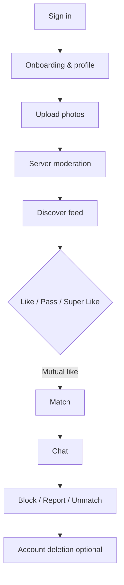
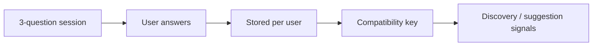
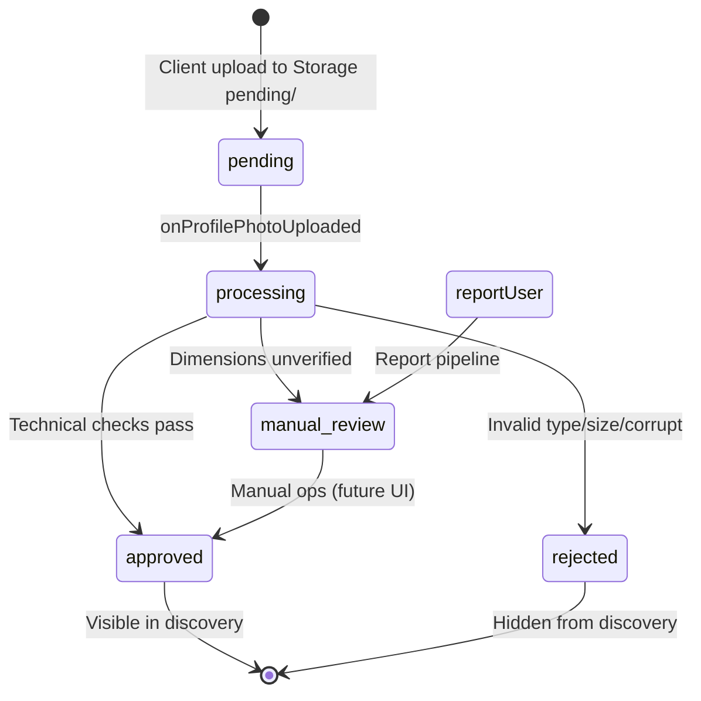
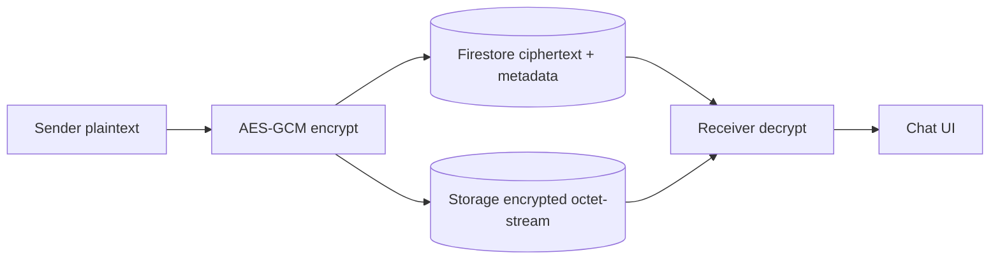
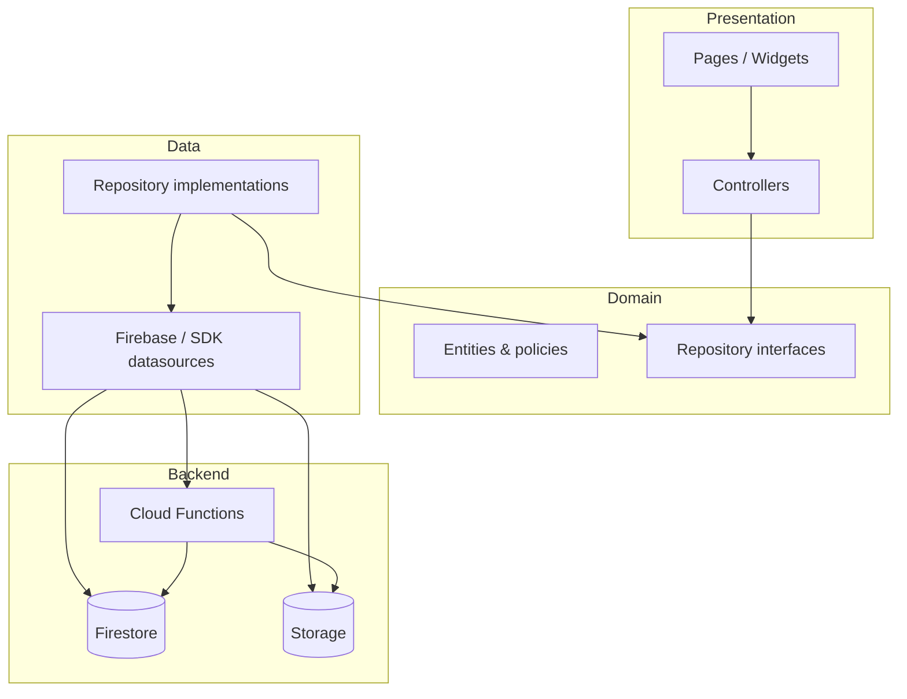
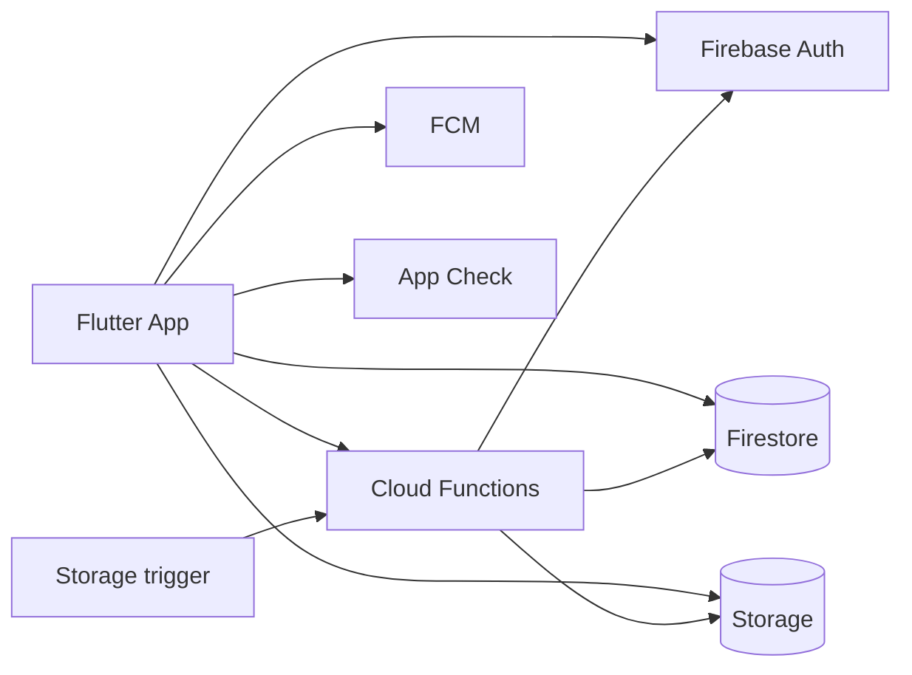
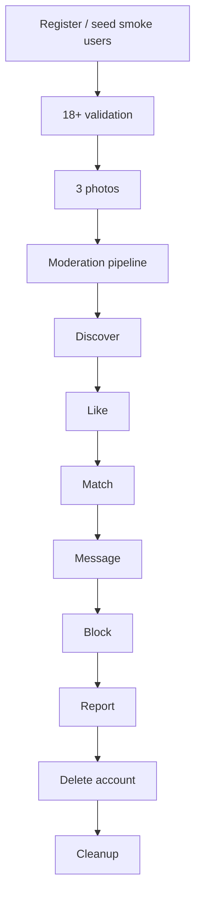

<p align="center">
  <a href="README.md">English</a> · <a href="README.tr.md">Türkçe</a>
</p>

<p align="center">
  
</p>

<h1 align="center">💜 Mevora</h1>

<p align="center">
  <strong>Discover people. Understand compatibility. Start something meaningful.</strong>
</p>

<p align="center">
  Mevora is a Flutter + Firebase dating app for iOS and Android. It combines swipe discovery with interest matching, music taste signals, relationship-view questions, and server-enforced safety — without exposing exact GPS to other users.
</p>

<p align="center">
  
  
  
  
  
  
</p>

<p align="center">
  <code>com.mevora.app</code> · production Firebase project: <code>mevora-production</code>
</p>

---

## Table of contents

- [At a glance](#at-a-glance)
- [Screenshots & visuals](#screenshots--visuals)
- [What is Mevora?](#what-is-mevora)
- [How it works](#how-it-works)
- [Compatibility engine](#compatibility-engine)
- [Relationship question system](#relationship-question-system)
- [Messaging & chat E2EE](#messaging--chat-e2ee)
- [Safety & trust](#safety--trust)
- [Photo moderation](#photo-moderation)
- [Feature matrix](#feature-matrix)
- [Tech stack](#tech-stack)
- [Architecture](#architecture)
- [Firebase architecture](#firebase-architecture)
- [Project structure](#project-structure)
- [Security](#security)
- [Privacy & data handling](#privacy--data-handling)
- [Admin & operations](#admin--operations)
- [Testing](#testing)
- [QA system](#qa-system)
- [Multi-emulator & real-device testing](#multi-emulator--real-device-testing)
- [Production smoke test](#production-smoke-test)
- [Getting started](#getting-started)
- [Environments & secrets](#environments--secrets)
- [Git workflow](#git-workflow)
- [Production readiness workflow](#production-readiness-workflow)
- [Project status](#project-status)
- [Recent development](#recent-development)
- [Roadmap](#roadmap)
- [Documentation map](#documentation-map)
- [License](#license)

---

## At a glance

| | |
| --- | --- |
| **Type** | 18+ dating & social discovery |
| **Architecture** | Feature-first Clean Architecture |
| **State** | `ChangeNotifier` controllers + `InheritedWidget` scopes |
| **Routing** | `go_router` with tab shell |
| **Backend** | Firebase Auth, Firestore, Storage, Cloud Functions, FCM |
| **Locales** | English · Turkish (`gen-l10n`) |
| **Store status** | Private repository — not a public store release claim |

---

## Screenshots & visuals

Captured from the **development flavor** on Android emulator plus in-app portrait assets used on Discover cards. Paths are relative so images render on GitHub.

### App screens (live UI captures)

<p align="center">
  
  
  
</p>

<p align="center">
  
  
  
</p>

| Screen | File | Notes |
| --- | --- | --- |
| Login / welcome | `docs/images/mevora-login.png` | Google · Apple · email · phone entry |
| Register | `docs/images/mevora-register.png` | Account creation flow |
| Email sign-in | `docs/images/mevora-login-email.png` | Email + password form |
| Phone sign-in | `docs/images/mevora-phone.png` | OTP entry screen |
| Hero banner | `docs/images/mevora-hero.png` | Login hero asset (`login_background.jpg`) |
| Discover portraits | `docs/images/portrait-0N.jpg` | Mock portraits used on Discover cards |

### Discovery portrait samples (in-app assets)

<p align="center">
  
  
  
  
  
  
</p>

| Area | In app | Status |
| --- | --- | --- |
| Login / welcome | `authentication` feature | Implemented |
| Phone OTP | `/phone` flow | Implemented |
| Onboarding & profile | multi-step wizard | Implemented |
| Discover / swipe | card stack + actions | Implemented |
| Match celebration | Rive accent | Implemented |
| Chat | text, image, GIF, voice | Implemented |
| Music tab | Spotify-linked taste UI | Implemented |
| Boost / IAP | consumable packs | Implemented |
| Video calls | LiveKit provider | Implemented, **feature flag off by default** |
| Full authenticated UI screenshot set | Discover · Match · Chat tabs | **Partial** — auth screens captured; main tabs need signed-in device run |

### Screen coverage map

| Login / auth | Onboarding / profile | Discover / swipe |
| --- | --- | --- |
| Implemented | Implemented | Implemented |
| Match / celebration | Chat | Settings / safety |
| Implemented | Implemented | Implemented |
| Music tab | Boost / IAP | Relationship questions |
| Implemented | Implemented | Implemented |
| Video calls | Photo moderation (backend) | — |
| Implemented, flag off | Implemented (no AI) | — |

---

## What is Mevora?

Mevora helps people find connections they are likely to click with through:

- **Personalized discovery** — server-side candidate feed with filters (age, distance, gender prefs, activity window)
- **Compatibility signals** — shared interests, relationship goals, music taste, relationship Q&A alignment
- **Match Score** — server-side scoring and post-match feedback prompts
- **Safety tooling** — 18+ gate, report, block, unmatch, account deletion, photo moderation pipeline
- **Privacy-first location** — distance labels from Cloud Functions; other users never receive raw coordinates

Mevora is **not** marketed here as “AI-powered matching” or “guaranteed matches.” Signals are rule-based and server-validated.

---

## How it works



**Typical user path**

1. Authenticate (email, Google, Apple, phone, optional Spotify when enabled)
2. Complete onboarding (18+, bio, interests, lifestyle, min **3** photos)
3. `completeOnboarding` callable validates age + approved photos server-side
4. Discovery loads via `getDiscoveryCandidates` / `getDiscoveryFeed`
5. Mutual likes create matches (`recordSwipe` / `recordDiscoveryDecision`)
6. Chat writes to `matches/{id}/messages` under Firestore rules
7. Safety actions call `blockUser`, `reportUser`, `unmatchUser`
8. `deleteUserAccount` removes Auth + Firestore + Storage data

---

## Compatibility engine

Discovery ranking combines several **independent signals**. Values below are taken from the current Cloud Functions / domain code.

### Profile compatibility score (`compatibilityScore`)

Used in `getDiscoveryCandidates` (`functions/src/backend.ts`):

| Signal | Rule | Max contribution |
| --- | --- | --- |
| Shared interests | `min(25, sharedCount × 5)` | **25** |
| Same relationship goal | `+20` if goals match | **20** |
| **Total** | rounded integer | **45** |

This score is **not** a percentage and does not alone create a match.

### Music compatibility (separate field)

Client calculator (`music_compatibility.dart`):

| Component | Weight |
| --- | --- |
| Shared tracks | 40% |
| Shared artists | 30% |
| Shared genres | 20% |
| Recent listening habits | 10% |

Backend also applies a **ranking bonus** (`musicRankingBonus`) — music never replaces dating compatibility or auto-creates matches.

### Relationship compatibility (separate field)

When both users answered the same relationship questions:

```text
score = round(alignedCount / sharedQuestionCount × 100)
```

Relationship suggestions from `getRelationshipMatches` are **not** automatic mutual swipe matches.

### Other discovery filters (server-side)

- Self, blocked, liked, passed, active match partners excluded
- 90-day activity window on `users.lastActiveAt`
- Gender preference mutual check
- Min **3 approved** photos, 18+, account eligibility
- Radius presets: 5 / 10 / 25 / 50 / 100 km
- Boost visibility sorting (`sortByBoostVisibility`)

---

## Relationship question system

Implemented in `lib/features/relationship/` with **110+ catalog questions**, each with **3 answer options**, presented in fixed **3-question sessions** so two users can share answer keys.

### Topics in catalog (`RelationshipTopic`)

| Topic | Examples of theme |
| --- | --- |
| `jealousy` | Boundaries around jealousy |
| `trust` | Trust expectations |
| `loyalty` | Commitment signals |
| `communication` | How you talk through conflict |
| `boundaries` | Personal limits |
| `socialLife` | Nights out, social energy |
| `friendship` | Friend vs partner balance |
| `personalSpace` | Alone time |
| `futurePlans` | Long-term direction |
| `money` | Financial habits |
| `flirting` | Flirting boundaries |
| `exes` | Past relationships |
| `expectations` | What you expect from a partner |

Prompts and answers are localized (**EN / TR**). Cloud Functions: `saveRelationshipAnswer`, `getRelationshipAnswered`, `getRelationshipMatches`, `completeRelationshipTest`.



---

## Safety & trust

| Feature | Status | Notes |
| --- | --- | --- |
| 🔞 18+ age gate | Implemented | Client validators + `completeOnboarding` + `profileSafety.ts` |
| 🔐 Server-side onboarding flags | Implemented | Clients cannot set `isDiscoverable` directly |
| 🛡️ Report user | Implemented | Whitelist reasons, 20/day limit |
| 🚫 Block user | Implemented | `blocks/` + `users/.../blockedUsers/` |
| Unmatch | Implemented | Deactivates match server-side |
| Message rate limit | Implemented | 20/min per match, 60/min global |
| Discovery safety sheet | Implemented | Hide / block / report from profile |
| 🗑️ Account deletion | Implemented | `deleteUserAccount` callable |
| 📍 Location privacy | Implemented | GPS owner-only; others get distance labels |
| 📸 Photo moderation | Implemented | Technical pipeline, no AI (see below) |
| Profile read enumeration hardening | In progress | `profiles` still readable to authenticated users |
| AI content moderation | Planned | Architecture allows future provider |

---

## Photo moderation

Current implementation is **server-controlled** and does **not** use AI/ML image classification.



| Stage | Owner |
| --- | --- |
| Upload | Client → `users/{uid}/profile/pending/` |
| Publish to `photos/` | Cloud Functions only |
| Status fields | `moderationStatus`, `moderatedBy`, `moderationReason` |
| Client escalation guard | `enforceProfilePhotoModeration` trigger |

Details: [docs/PHOTO_MODERATION.md](docs/PHOTO_MODERATION.md)

---

## Feature matrix

| Feature | Status |
| --- | --- |
| Email / password auth | Implemented |
| Google Sign-In | Implemented |
| Sign in with Apple | Implemented |
| Phone OTP | Implemented |
| Spotify login | Implemented, **off by default** (`FeatureFlags.spotifyLoginEnabled`) |
| Multi-step onboarding | Implemented |
| Profile edit & settings | Implemented |
| Photo upload (min 3, max 6) | Implemented |
| Discover / swipe | Implemented |
| Like / pass / super like | Implemented |
| Mutual match creation | Implemented (server authoritative) |
| Compatibility scoring | Implemented |
| Relationship questions | Implemented |
| Music match / Spotify taste | Implemented |
| Match Score & feedback | Implemented |
| Text / image / GIF / voice chat | Implemented |
| Chat E2EE (fail-closed for new sends) | Implemented — see [Messaging & chat E2EE](#messaging--chat-e2ee) |
| Push notifications (FCM) | Implemented |
| Block / report / unmatch | Implemented |
| Boost IAP (consumable) | Implemented |
| Subscriptions | **Disabled placeholder** only |
| Video calls (LiveKit) | Implemented, **feature flag off by default** |
| Sumsub profile verification | Implemented (sandbox/production secrets required) |
| Photo moderation pipeline | Implemented (technical, no AI) |
| Firebase App Check | Implemented |
| Crashlytics & Analytics | Implemented |
| Firebase Remote Config SDK | **Partial / WIP** — local defaults via `MevoraRemoteConfig`; SDK wiring lives on WIP branch |
| Hosting admin / automation console | **In progress** — rules + WIP code on `wip/preserve-dirty-tree-20260825` (not merged to `main`) |
| Automated device E2E | Partial (`integration_test/smoke/`, needs device) |
| Multi-emulator Firebase seed/verify | Implemented tooling (`tool/qa_multi_user_*`) — UI dual-login still Partial |
| Backend production smoke harness | Implemented (`tools/smoke/`) |
| CI workflow | Implemented (`.github/workflows/smoke.yml`) |

---

## Tech stack

| Layer | Technology |
| --- | --- |
| Mobile | Flutter |
| Language | Dart `^3.11.5` |
| Navigation | `go_router` |
| State / DI | `ChangeNotifier` + scope widgets |
| Auth | Firebase Auth |
| Database | Cloud Firestore |
| Files | Firebase Storage |
| Logic | Cloud Functions (Node 20, TypeScript) |
| Push | Firebase Cloud Messaging |
| Crashes | Firebase Crashlytics |
| Analytics | Firebase Analytics |
| Attestation | Firebase App Check |
| Maps / location | `geolocator`, server-side distance |
| Purchases | `in_app_purchase` (Boost packs) |
| Motion | Rive |
| Video | LiveKit (`livekit_client`) |
| Voice chat media | `record`, `audioplayers` |
| Chat E2EE crypto | `cryptography` (X25519, HKDF, AES-GCM) + `flutter_secure_storage` |
| Identity verification | Sumsub mobile SDK + Cloud Functions webhooks |

---

## Messaging & chat E2EE

Chat is realtime over Firestore under `matches/{matchId}/messages`. New sends are **fail-closed**: clients require an E2EE session; plaintext fallback for new messages is not used.



| Channel | Storage / path (owner-scoped) | Notes |
| --- | --- | --- |
| Text | `matches/{matchId}/messages` | Ciphertext + E2EE fields required by rules |
| Image / voice | `users/{uid}/chat/{matchId}/…` | Encrypted blobs (`application/octet-stream`) |
| Typing / presence | match `meta` / user presence docs | Privacy-aware; not plaintext message bodies |
| FCM | Generic notification types | No message body / no E2EE plaintext in push |

**Honest scope:** this is **not** Signal-grade (no Double Ratchet / forward secrecy). See [docs/E2EE_SECURITY.md](docs/E2EE_SECURITY.md) and [docs/E2EE_PROTOCOL_EVALUATION.md](docs/E2EE_PROTOCOL_EVALUATION.md).

Peer display names in the chat AppBar come from match/profile plumbing (`controller.otherName`), not a hardcoded brand string.

---

## Architecture



**Rules**

- No Riverpod / Bloc / GetIt — constructor injection + scopes (`AuthScope`, `DiscoveryScope`, …)
- Presentation never imports Firebase SDK types directly for business rules
- Matching rules oracle: `MatchEngine` (shared with Functions semantics)

Deep dive: [ARCHITECTURE.md](ARCHITECTURE.md)

---

## Firebase architecture



**Key collections** (from `firebase/firestore.rules` — not exhaustive)

| Path | Purpose |
| --- | --- |
| `users/{uid}` | Private account (owner read) |
| `users/{uid}/devices`, `fcmTokens` | Device / push registration |
| `users/{uid}/crypto` | E2EE public identity material |
| `users/{uid}/relationshipAnswers` | Relationship Q&A answers |
| `users/{uid}/questionAnswers` | Profile question answers |
| `users/{uid}/verification` | Sumsub verification state |
| `profiles/{uid}` | Public dating card |
| `userPreferences/{uid}` | Discovery prefs |
| `userLocation/{uid}` | GPS (server-side reads for distance) |
| `userPrivacy/{uid}`, `userSettings/{uid}` | Privacy / settings |
| `matches/{id}` | Active matches |
| `matches/{id}/messages` | Chat (E2EE ciphertext) |
| `likes/{from}_{to}` | Swipe records (server writes) |
| `blocks/{blocker}_{blocked}` | Blocks |
| `reports/{id}` | User reports (create often CF-gated) |
| `notifications/{id}` | In-app notifications |
| `supportTickets/{id}` | Support |
| `calls/{id}`, `callHistory/{id}` | Call signaling / history |
| `auditLogs`, `automationJobs`, `adminReviewQueue` | Ops / admin (admin-read in rules) |

**Storage (high level)**

| Path pattern | Purpose |
| --- | --- |
| `users/{uid}/profile/pending/` | Client photo upload |
| `users/{uid}/profile/photos/` (approved) | Functions-published discovery photos |
| `users/{uid}/chat/{matchId}/…` | Encrypted chat media blobs |

References: [FIREBASE_ARCHITECTURE.md](FIREBASE_ARCHITECTURE.md) · [FIREBASE_DATA_ARCHITECTURE.md](FIREBASE_DATA_ARCHITECTURE.md) · [docs/E2EE_SECURITY.md](docs/E2EE_SECURITY.md)

---

## Project structure

```text
Mevora/
├── lib/
│   ├── core/           config, routing, theme, DI, Firebase bootstrap
│   ├── features/
│   │   ├── authentication/
│   │   ├── onboarding/
│   │   ├── profile/
│   │   ├── discovery/
│   │   ├── matching/
│   │   ├── match_score/
│   │   ├── relationship/
│   │   ├── music/
│   │   ├── chat/          (+ e2ee/)
│   │   ├── calls/
│   │   ├── boost/
│   │   ├── safety/
│   │   ├── settings/
│   │   ├── support/
│   │   ├── verification/
│   │   └── …
│   ├── shared/         design system, Rive wrappers
│   └── l10n/
├── functions/src/      Cloud Functions + moderation + smoke helpers
├── firebase/           Firestore/Storage rules, indexes, rules tests
├── test/               unit + widget + security contract tests
├── integration_test/   device E2E entry (requires connected device)
├── tools/smoke/        backend production smoke runner
├── tool/               local QA seed/verify helpers (emulator multi-user)
├── qa/                 QA reports, Git handoff, release readiness
└── docs/               architecture & runbooks
```

---

## Security

- **Firestore rules** — lifecycle fields, blocks, reports, server-only purchases/rate limits, E2EE message field requirements
- **Storage rules** — clients upload `pending/` only; approved `photos/` publish is Functions-only; chat media as encrypted blobs
- **Chat E2EE** — fail-closed new sends; private keys on-device (`flutter_secure_storage`); Firebase stores ciphertext
- **App Check** — debug providers in development; Play Integrity / App Attest in production
- **Server validation** — onboarding completion, swipes, boosts, reports, deletion
- **18+ enforcement** — client + `completeOnboarding` + discovery filters
- **Smoke test isolation** — `isSmokeTestUser` is server-only; smoke users only see each other in discovery
- **Admin gates** — `isAdmin()` in rules for ops collections; full admin console still WIP (see below)

More: [FIREBASE_SECURITY.md](FIREBASE_SECURITY.md) · [LOCATION_ARCHITECTURE.md](LOCATION_ARCHITECTURE.md) · [docs/E2EE_SECURITY.md](docs/E2EE_SECURITY.md)

---

## Privacy & data handling

Technical privacy posture (not a legal opinion):

| Topic | Status |
| --- | --- |
| Exact GPS never shared to peers | Implemented (distance labels via Functions) |
| Account deletion callable | Implemented (`deleteUserAccount` / expanded server cleanup) |
| Data export | Implemented (settings export + Functions export notes) |
| E2EE message bodies omitted from exports | Implemented (see Functions export messaging) |
| Data retention plan | Documented — [docs/DATA_RETENTION_PLAN.md](docs/DATA_RETENTION_PLAN.md) |
| Store / privacy readiness notes | [docs/PRIVACY_STORE_READINESS.md](docs/PRIVACY_STORE_READINESS.md) |

> **Legal / KVKK compliance requires professional legal review.** This README describes engineering controls only.

---

## Admin & operations

| Capability | Status |
| --- | --- |
| Firestore `isAdmin()` + admin-readable ops collections | Implemented in rules |
| `auditLogs`, `automationJobs`, `adminReviewQueue` | Present in rules / backend design |
| Hosting `/admin` console + Cloud Functions automation package | **In progress** on branch `wip/preserve-dirty-tree-20260825` |
| Role matrix (SUPER_ADMIN / MODERATOR / SUPPORT / ANALYST) | **Planned / partial WIP** — do not treat as production-complete |
| Mobile app embeds admin UI | **No** — admin is separate from the dating client |

Details: [docs/ADMIN_PANEL.md](docs/ADMIN_PANEL.md)

---

## Testing

| Layer | Location | Status |
| --- | --- | --- |
| Unit / widget tests | `test/` (~150 Dart test files) | Implemented — full suite recently **654** passing on CI/dev host |
| Cloud Functions tests | `functions/test/` | Implemented — recently **78** passing |
| Firestore rules tests | `firebase/tests/` | Implemented |
| Security contract tests | `test/security/` | Implemented |
| Integration config test | `test/integration/` | Implemented |
| Device E2E smoke | `integration_test/smoke/` | Partial — launch + email harness; needs stable device run |
| Emulator multi-user seed/verify | `tool/qa_multi_user_*.cjs` | Implemented (Auth/Firestore emulator Admin SDK) |
| Backend smoke | `tools/smoke/run_smoke_test.mjs` | Implemented |
| CI | `.github/workflows/smoke.yml` | Implemented |

```bash
# Flutter
flutter doctor
flutter analyze
flutter test

# Device / emulator integration (example)
flutter test integration_test/smoke/app_launch_test.dart -d <deviceId> --flavor development

# Cloud Functions
cd functions && npm test

# Firestore / moderation integration
cd firebase/tests && npm test

# Local Firebase Emulator Suite + multi-user seed (dev machine)
firebase emulators:start --only auth,firestore,storage --project mevora-d6ed0
# then (with JAVA_HOME set if needed):
node tool/qa_multi_user_seed_admin.cjs
node tool/qa_multi_user_verify.cjs

# Backend smoke (requires service account — never commit credentials)
cd tools/smoke && npm install
# set GOOGLE_APPLICATION_CREDENTIALS, then:
node run_smoke_test.mjs
```

Smoke flow documentation: [docs/SMOKE_TEST.md](docs/SMOKE_TEST.md) · QA overview: [docs/QA.md](docs/QA.md)

---

## QA system

Engineering QA ladder used on this repo:

```text
Static analysis (flutter analyze)
        ↓
Unit / widget / Functions / rules tests
        ↓
Integration_test smoke (device/emulator)
        ↓
Firebase Emulator multi-user seed/verify
        ↓
Multi-emulator UI attempts + screenshots
        ↓
Real device (when connected)
        ↓
Regression after fixes
        ↓
Release APK cold-start checks
        ↓
Release readiness decision (qa/RELEASE_READINESS.md)
```

Latest overnight reports live under [`qa/`](qa/) (e.g. `FULL_QA_REPORT.md`, `multi-emulator-report.md`, `GIT_HANDOFF.md`). Current release readiness from that run: **RED — not ready for public store**.

---

## Multi-emulator & real-device testing

| Mode | Purpose | Status |
| --- | --- | --- |
| Emulator A / B (+ optional C) | Parallel installs of the same APK | Tooling implemented; UI dual-login still Partial |
| Auth + Firestore emulators | Isolated USER A/B/C seed, match, message verify | Implemented |
| Live Firebase on emulator | Auth welcome / release APK smoke | Partial |
| Physical Android | Camera, mic, FCM kill-state, Play Integrity | Required for release — often **Blocked** if no USB device |

Recommended pairing for full product E2E (when UI login automation is stable):

```text
Emulator/Device A → USER A
Emulator/Device B → USER B
Signup → onboarding → questions → discover → like → match → chat
```

Use **smoke / QA emails only** (`smoke-a@mevora.test`, `qa-a@mevora.test`, …). Never use real customer accounts for automated tests.

---

## Production smoke test

Backend smoke harness validates critical production flows against **real Firebase state** (not fake UI success).



| Component | Location | Status |
| --- | --- | --- |
| Backend runner | `tools/smoke/run_smoke_test.mjs` | Implemented |
| Smoke users | `smoke-a@mevora.test`, `smoke-b@mevora.test` | Implemented |
| Isolation flag | `users.isSmokeTestUser` (server-only) | Implemented |
| Device E2E | `integration_test/smoke/` | Partial — requires connected device |
| CI workflow | `.github/workflows/smoke.yml` | Implemented |

Run with a **service account** (never commit credentials). See [docs/SMOKE_TEST.md](docs/SMOKE_TEST.md).

---

## Getting started

### Prerequisites

- Flutter SDK compatible with `sdk: ^3.11.5`
- Xcode / Android Studio
- Node.js 20+ for Cloud Functions
- Firebase CLI

### Install & run

```bash
git clone https://github.com/HalilMertDeveli/mevora.git
cd mevora
flutter pub get

# Development flavor
flutter run --flavor development -t lib/main_development.dart

# Staging
flutter run --flavor staging -t lib/main_staging.dart

# Production flavor (local testing only — use with care)
flutter run --flavor production -t lib/main_production.dart
```

### Cloud Functions

```bash
cd functions
npm install
npm run build
# Confirm Firebase project before deploy:
# firebase deploy --only functions,firestore:rules,storage --project mevora-production
```

### Emulators (optional)

```bash
firebase emulators:start --only firestore,functions,storage,auth
flutter run --dart-define=USE_EMULATORS=true -t lib/main_development.dart
```

Phone Auth typically needs a **live** Firebase project for real SMS unless using test numbers / Auth emulator.

---

## Environments & secrets

| Flavor | Entry | Android `applicationId` | Firebase project |
| --- | --- | --- | --- |
| development | `main_development.dart` | `com.mevora.app` (same id for OAuth SHA registration; `-dev` versionNameSuffix) | `mevora-d6ed0` |
| staging | `main_staging.dart` | `com.mevora.app.staging` | `mevora-staging` |
| production | `main_production.dart` | `com.mevora.app` | `mevora-production` |

Default live backend for `USE_EMULATORS=false` development builds is **`mevora-d6ed0`**. Opt into the Emulator Suite only when it is running (`USE_EMULATORS=true`, optional `USE_AUTH_EMULATOR=true`).

**Never commit:** `.env`, keystores, service account JSON, Spotify client secret, LiveKit secrets, Apple signing keys, App Check debug token files.

Public client IDs may be passed via `--dart-define` (e.g. `SPOTIFY_CLIENT_ID`, `FIREBASE_APP_CHECK_DEBUG_TOKEN`). Prefer `tool/flutter_run_dev.ps1` / `tool/app_check_debug_token.local` for local App Check. See [FIREBASE_SETUP.md](FIREBASE_SETUP.md).

---

## Git workflow

Do **not** develop experimental QA fixes directly on `main`. Current engineering pattern:

```text
main / backup tip
        ↓
qa/baseline  (tag: qa-stable-baseline)
        ↓
fix/<bug>  or  test/<suite>  or  qa/<area>
        ↓
automated + device checks
        ↓
commit + push
        ↓
merge into qa/integration  (RC: release/mevora-v1.0.0-rc1)
```

| Branch / tag | Purpose |
| --- | --- |
| `qa/baseline` · `qa-stable-baseline` | Pre-QA-split stable product tip (`dd03fd1` privacy/E2EE harden) |
| `fix/*` | Atomic bug fixes (e.g. `fix/fcm-incoming-like-types`) |
| `test/*` | Test harness alignment |
| `qa/firebase`, `qa/release`, `qa/integration` | Firebase tooling, reports, aggregate QA |
| `wip/preserve-dirty-tree-20260825` | Full dirty-tree safety snapshot (includes admin WIP) |
| `release/mevora-v1.0.0-rc1` | Release **candidate** tracker — not a store ship claim |

Safety: no force-push to `main`, no `git reset --hard` for cleanup, preserve failed fix branches as `fix/<name>-v2` when retrying.

Details: [docs/GIT_WORKFLOW.md](docs/GIT_WORKFLOW.md) · [qa/GIT_HANDOFF.md](qa/GIT_HANDOFF.md)

---

## Production readiness workflow

```text
Development (mevora-d6ed0)
        ↓
QA (analyze → unit → integration → multi-emu → real device)
        ↓
Security / rules / E2EE review
        ↓
Release candidate branch + signed release build
        ↓
Internal testing track
        ↓
Production (mevora-production) — only when readiness is green
```

Release signing is still **debug keystore** in `android/app/build.gradle.kts` until a Play upload key is wired. Treat store launch as blocked until signing, dual-device messaging, and readiness docs flip green.

---

## Project status

| Area | Status |
| --- | --- |
| Core dating product (auth → discover → match → chat) | Implemented |
| Compatibility / relationship / music signals | Implemented |
| Chat E2EE fail-closed | Implemented |
| Safety (block/report/delete/moderation pipeline) | Implemented |
| Boost IAP | Implemented |
| Video calls | Implemented, flag off |
| Spotify login | Implemented, flag off by default |
| Admin hosting console / automation package | In progress (WIP branch) |
| Multi-emulator UI E2E | Partial |
| Real-device release gate | Blocked until devices + signing ready |
| Public store release | **Not ready** (see `qa/RELEASE_READINESS.md`) |

---

## Recent development

| Item | Summary |
| --- | --- |
| `dd03fd1` | Privacy/security rules harden + fail-closed E2EE |
| `qa/integration` | Aggregated QA fixes, tests, emulator tooling, reports |
| `fix/fcm-incoming-like-types` | Restore missing `incomingLike` FCM types |
| `docs/readme-complete` | README merge of architecture + QA + Git documentation |
| `121aca5` / `bf76035` | Profile Q&A edit + question-priority matching / likes-you gate |
| `8946ffb` | Production hardening, photo moderation, smoke tests |

---

## Roadmap

Verified gaps / planned improvements (not implemented as full products yet):

- AI/ML photo moderation provider (architecture ready, not active)
- Complete Firebase Remote Config SDK wiring (defaults exist; SDK WIP)
- Stronger profile read model (reduce authenticated enumeration surface)
- Stable dual-device / multi-emulator **UI** E2E (seed/verify exists; login automation Partial)
- Live subscriptions (placeholder module only today)
- Production admin moderation console (WIP on preserve branch)
- Play App Signing + R8 for store builds
- Expanded analytics for safety events

---

## Documentation map

| Topic | Document |
| --- | --- |
| Architecture | [ARCHITECTURE.md](ARCHITECTURE.md) · [docs/ARCHITECTURE.md](docs/ARCHITECTURE.md) |
| Firebase overview | [FIREBASE_ARCHITECTURE.md](FIREBASE_ARCHITECTURE.md) |
| Data model | [FIREBASE_DATA_ARCHITECTURE.md](FIREBASE_DATA_ARCHITECTURE.md) |
| Security | [FIREBASE_SECURITY.md](FIREBASE_SECURITY.md) |
| Chat E2EE | [docs/E2EE_SECURITY.md](docs/E2EE_SECURITY.md) |
| Privacy / retention | [docs/PRIVACY_STORE_READINESS.md](docs/PRIVACY_STORE_READINESS.md) · [docs/DATA_RETENTION_PLAN.md](docs/DATA_RETENTION_PLAN.md) |
| Photo moderation | [docs/PHOTO_MODERATION.md](docs/PHOTO_MODERATION.md) |
| Smoke testing | [docs/SMOKE_TEST.md](docs/SMOKE_TEST.md) |
| QA system | [docs/QA.md](docs/QA.md) · [`qa/`](qa/) |
| Git workflow | [docs/GIT_WORKFLOW.md](docs/GIT_WORKFLOW.md) · [qa/GIT_HANDOFF.md](qa/GIT_HANDOFF.md) |
| Admin / ops | [docs/ADMIN_PANEL.md](docs/ADMIN_PANEL.md) |
| Phone auth | [PHONE_AUTH_IMPLEMENTATION.md](PHONE_AUTH_IMPLEMENTATION.md) |
| Boost / IAP | [PAYMENT_ARCHITECTURE.md](PAYMENT_ARCHITECTURE.md) |
| Localization | [LOCALIZATION_ARCHITECTURE.md](LOCALIZATION_ARCHITECTURE.md) |
| Sumsub | [docs/SUMSUB_SETUP.md](docs/SUMSUB_SETUP.md) |
| Rive assets | [assets/rive/ASSETS.md](assets/rive/ASSETS.md) |
| README handoff | [docs/README_DOCUMENTATION_HANDOFF.md](docs/README_DOCUMENTATION_HANDOFF.md) |

---

## License

Private and proprietary. All rights reserved.
