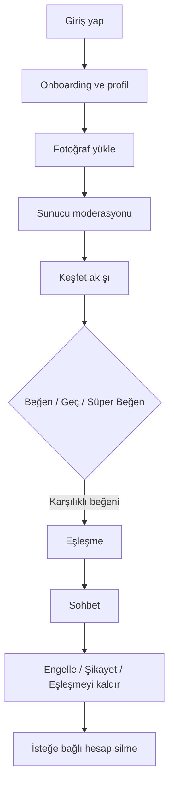
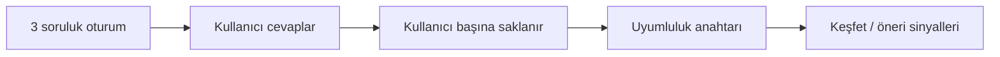
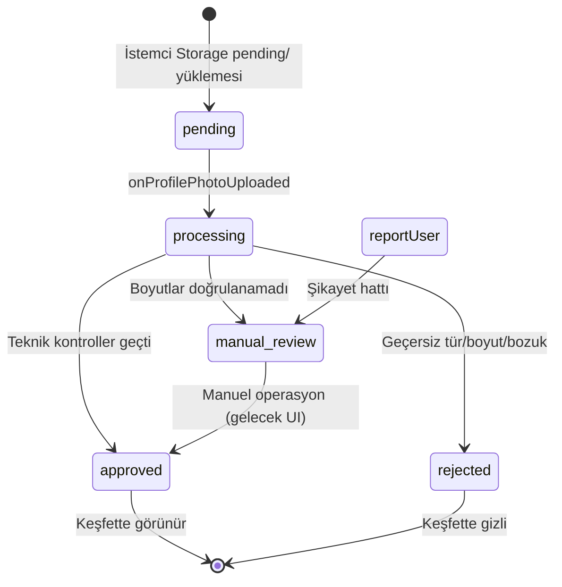
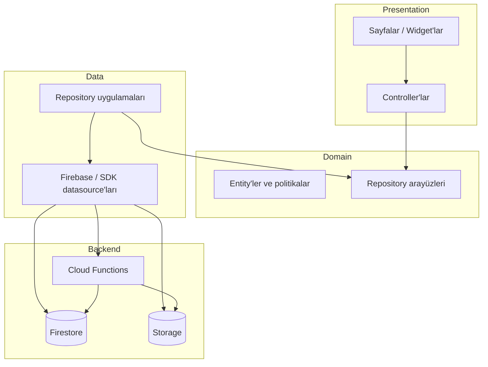
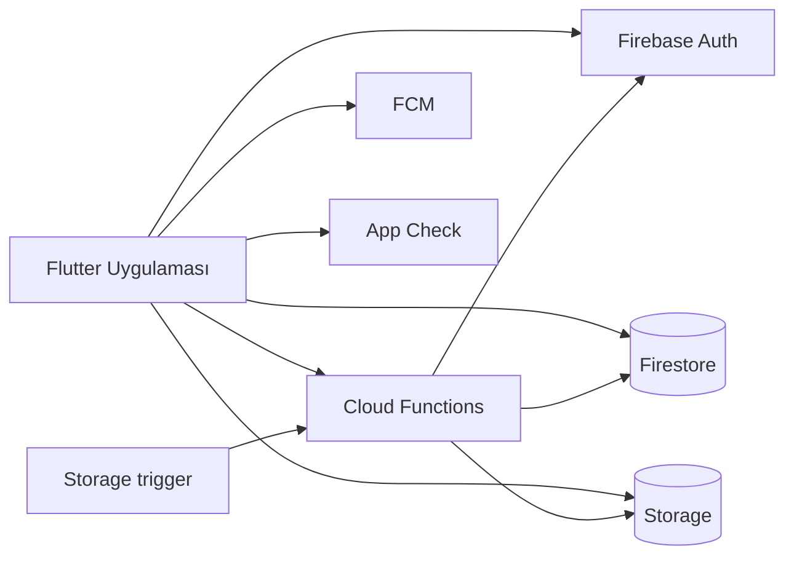
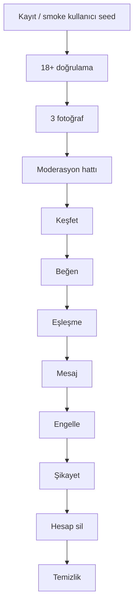

<p align="center">
  <a href="README.md">English</a> · <a href="README.tr.md">Türkçe</a>
</p>

<p align="center">
  
</p>

<h1 align="center">💜 Mevora</h1>

<p align="center">
  <strong>İnsanları keşfet. Uyumu anla. Anlamlı bir şey başlat.</strong>
</p>

<p align="center">
  Mevora, iOS ve Android için Flutter + Firebase tabanlı bir dating uygulamasıdır. Kaydırarak keşfetmeyi; ilgi alanı eşleşmesi, müzik zevki sinyalleri, ilişki görüşü soruları ve sunucu tarafı güvenlik ile birleştirir — diğer kullanıcılara tam GPS asla gösterilmez.
</p>

<p align="center">
  
  
  
  
  
  
</p>

<p align="center">
  <code>com.mevora.app</code> · production Firebase projesi: <code>mevora-production</code>
</p>

---

## İçindekiler

- [Özet](#özet)
- [Ekran görüntüleri ve görseller](#ekran-görüntüleri-ve-görseller)
- [Mevora nedir?](#mevora-nedir)
- [Nasıl çalışır?](#nasıl-çalışır)
- [Uyumluluk motoru](#uyumluluk-motoru)
- [İlişki soru sistemi](#ilişki-soru-sistemi)
- [Güvenlik ve güven](#güvenlik-ve-güven)
- [Fotoğraf moderasyonu](#fotoğraf-moderasyonu)
- [Özellik matrisi](#özellik-matrisi)
- [Teknoloji yığını](#teknoloji-yığını)
- [Mimari](#mimari)
- [Firebase mimarisi](#firebase-mimarisi)
- [Proje yapısı](#proje-yapısı)
- [Güvenlik](#güvenlik)
- [Test](#test)
- [Production smoke test](#production-smoke-test)
- [Başlangıç](#başlangıç)
- [Ortamlar ve gizli bilgiler](#ortamlar-ve-gizli-bilgiler)
- [Son geliştirmeler](#son-geliştirmeler)
- [Yol haritası](#yol-haritası)
- [Dokümantasyon haritası](#dokümantasyon-haritası)
- [Lisans](#lisans)

---

## Özet

| | |
| --- | --- |
| **Tür** | 18+ dating ve sosyal keşif |
| **Mimari** | Feature-first Clean Architecture |
| **State** | `ChangeNotifier` controller'lar + `InheritedWidget` scope'ları |
| **Routing** | Tab shell ile `go_router` |
| **Backend** | Firebase Auth, Firestore, Storage, Cloud Functions, FCM |
| **Diller** | İngilizce · Türkçe (`gen-l10n`) |
| **Mağaza durumu** | Özel depo — herkese açık mağaza sürümü iddiası yok |

---

## Ekran görüntüleri ve görseller

**Development flavor** üzerinde Android emülatörden alınmış canlı UI görüntüleri ve Keşfet kartlarında kullanılan uygulama içi portre asset'leri. Yollar relative olduğu için GitHub'da doğrudan görüntülenir.

### Uygulama ekranları (canlı UI yakalamaları)

<p align="center">
  
  
  
</p>

<p align="center">
  
  
  
</p>

| Ekran | Dosya | Not |
| --- | --- | --- |
| Giriş / karşılama | `docs/images/mevora-login.png` | Google · Apple · e-posta · telefon girişi |
| Kayıt | `docs/images/mevora-register.png` | Hesap oluşturma akışı |
| E-posta ile giriş | `docs/images/mevora-login-email.png` | E-posta + şifre formu |
| Telefon ile giriş | `docs/images/mevora-phone.png` | OTP giriş ekranı |
| Hero banner | `docs/images/mevora-hero.png` | Giriş hero asset'i (`login_background.jpg`) |
| Keşfet portreleri | `docs/images/portrait-0N.jpg` | Keşfet kartlarında kullanılan mock portreler |

### Keşfet portre örnekleri (uygulama içi asset'ler)

<p align="center">
  
  
  
  
  
  
</p>

| Alan | Uygulamada | Durum |
| --- | --- | --- |
| Giriş / karşılama | `authentication` feature | Uygulandı |
| Telefon OTP | `/phone` akışı | Uygulandı |
| Onboarding ve profil | çok adımlı sihirbaz | Uygulandı |
| Keşfet / kaydırma | kart yığını + aksiyonlar | Uygulandı |
| Eşleşme kutlaması | Rive vurgusu | Uygulandı |
| Sohbet | metin, görsel, GIF, ses | Uygulandı |
| Müzik sekmesi | Spotify bağlantılı zevk UI | Uygulandı |
| Boost / IAP | tüketilebilir paketler | Uygulandı |
| Görüntülü arama | LiveKit sağlayıcı | Uygulandı, **varsayılan olarak feature flag kapalı** |
| Tam oturum açmış UI ekran görüntüleri | Keşfet · Eşleşme · Sohbet sekmeleri | **Kısmi** — auth ekranları yakalandı; ana sekmeler oturum açmış cihaz gerektirir |

### Ekran kapsam haritası

| Giriş / auth | Onboarding / profil | Keşfet / kaydırma |
| --- | --- | --- |
| Uygulandı | Uygulandı | Uygulandı |
| Eşleşme / kutlama | Sohbet | Ayarlar / güvenlik |
| Uygulandı | Uygulandı | Uygulandı |
| Müzik sekmesi | Boost / IAP | İlişki soruları |
| Uygulandı | Uygulandı | Uygulandı |
| Görüntülü arama | Fotoğraf moderasyonu (backend) | — |
| Uygulandı, flag kapalı | Uygulandı (AI yok) | — |

---

## Mevora nedir?

Mevora, insanların uyum sağlayabileceği bağlantıları şu yollarla bulmasına yardımcı olur:

- **Kişiselleştirilmiş keşif** — filtreli sunucu tarafı aday akışı (yaş, mesafe, cinsiyet tercihleri, aktivite penceresi)
- **Uyumluluk sinyalleri** — ortak ilgi alanları, ilişki hedefleri, müzik zevki, ilişki soru-cevap uyumu
- **Match Score** — sunucu tarafı puanlama ve eşleşme sonrası geri bildirim istemleri
- **Güvenlik araçları** — 18+ kapısı, şikayet, engelleme, eşleşmeyi kaldırma, hesap silme, fotoğraf moderasyon hattı
- **Gizlilik odaklı konum** — Cloud Functions mesafe etiketleri; diğer kullanıcılar ham koordinat almaz

Mevora burada **“yapay zeka destekli eşleştirme”** veya **“garantili eşleşme”** olarak pazarlanmaz. Sinyaller kural tabanlıdır ve sunucuda doğrulanır.

---

## Nasıl çalışır?



**Tipik kullanıcı yolu**

1. Kimlik doğrulama (e-posta, Google, Apple, telefon; etkinse isteğe bağlı Spotify)
2. Onboarding tamamlama (18+, bio, ilgi alanları, yaşam tarzı, min **3** fotoğraf)
3. `completeOnboarding` callable sunucuda yaşı + onaylı fotoğrafları doğrular
4. Keşfet `getDiscoveryCandidates` / `getDiscoveryFeed` ile yüklenir
5. Karşılıklı beğeniler eşleşme oluşturur (`recordSwipe` / `recordDiscoveryDecision`)
6. Sohbet Firestore kuralları altında `matches/{id}/messages` yoluna yazılır
7. Güvenlik aksiyonları `blockUser`, `reportUser`, `unmatchUser` çağırır
8. `deleteUserAccount` Auth + Firestore + Storage verisini kaldırır

---

## Uyumluluk motoru

Keşfet sıralaması birkaç **bağımsız sinyali** birleştirir. Aşağıdaki değerler mevcut Cloud Functions / domain kodundan alınmıştır.

### Profil uyumluluk skoru (`compatibilityScore`)

`getDiscoveryCandidates` içinde kullanılır (`functions/src/backend.ts`):

| Sinyal | Kural | Maks. katkı |
| --- | --- | --- |
| Ortak ilgi alanları | `min(25, sharedCount × 5)` | **25** |
| Aynı ilişki hedefi | hedefler eşleşirse `+20` | **20** |
| **Toplam** | yuvarlanmış tam sayı | **45** |

Bu skor **yüzde değildir** ve tek başına eşleşme oluşturmaz.

### Müzik uyumluluğu (ayrı alan)

İstemci hesaplayıcısı (`music_compatibility.dart`):

| Bileşen | Ağırlık |
| --- | --- |
| Ortak parçalar | %40 |
| Ortak sanatçılar | %30 |
| Ortak türler | %20 |
| Son dinleme alışkanlıkları | %10 |

Backend ayrıca **sıralama bonusu** uygular (`musicRankingBonus`) — müzik asla dating uyumluluğunun yerini almaz veya otomatik eşleşme oluşturmaz.

### İlişki uyumluluğu (ayrı alan)

Her iki kullanıcı da aynı ilişki sorularını yanıtladığında:

```text
score = round(alignedCount / sharedQuestionCount × 100)
```

`getRelationshipMatches` önerileri **otomatik karşılıklı kaydırma eşleşmesi değildir**.

### Diğer keşif filtreleri (sunucu tarafı)

- Kendisi, engellenenler, beğenilenler, geçilenler, aktif eşleşme partnerleri hariç
- `users.lastActiveAt` üzerinde 90 günlük aktivite penceresi
- Cinsiyet tercihi karşılıklı kontrolü
- Min **3 onaylı** fotoğraf, 18+, hesap uygunluğu
- Yarıçap ön ayarları: 5 / 10 / 25 / 50 / 100 km
- Boost görünürlük sıralaması (`sortByBoostVisibility`)

---

## İlişki soru sistemi

`lib/features/relationship/` içinde uygulanmıştır: **110+ katalog sorusu**, her biri **3 cevap seçeneği**, iki kullanıcının cevap anahtarlarını paylaşabilmesi için sabit **3 soruluk oturumlar**.

### Katalog konuları (`RelationshipTopic`)

| Konu | Tema örnekleri |
| --- | --- |
| `jealousy` | Kıskançlık sınırları |
| `trust` | Güven beklentileri |
| `loyalty` | Bağlılık sinyalleri |
| `communication` | Çatışmada iletişim |
| `boundaries` | Kişisel sınırlar |
| `socialLife` | Gece dışarı, sosyal enerji |
| `friendship` | Arkadaş vs partner dengesi |
| `personalSpace` | Yalnız kalma ihtiyacı |
| `futurePlans` | Uzun vadeli yön |
| `money` | Finansal alışkanlıklar |
| `flirting` | Flört sınırları |
| `exes` | Geçmiş ilişkiler |
| `expectations` | Partnere beklentiler |

Sorular ve cevaplar yerelleştirilmiştir (**EN / TR**). Cloud Functions: `saveRelationshipAnswer`, `getRelationshipAnswered`, `getRelationshipMatches`, `completeRelationshipTest`.



---

## Güvenlik ve güven

| Özellik | Durum | Not |
| --- | --- | --- |
| 🔞 18+ yaş kapısı | Uygulandı | İstemci doğrulayıcıları + `completeOnboarding` + `profileSafety.ts` |
| 🔐 Sunucu tarafı onboarding bayrakları | Uygulandı | İstemciler `isDiscoverable` doğrudan set edemez |
| 🛡️ Kullanıcı şikayeti | Uygulandı | Beyaz liste nedenler, günde 20 limit |
| 🚫 Kullanıcı engelleme | Uygulandı | `blocks/` + `users/.../blockedUsers/` |
| Eşleşmeyi kaldırma | Uygulandı | Eşleşmeyi sunucu tarafında devre dışı bırakır |
| Mesaj hız limiti | Uygulandı | eşleşme başına 20/dk, global 60/dk |
| Keşfet güvenlik sayfası | Uygulandı | Profilden gizle / engelle / şikayet |
| 🗑️ Hesap silme | Uygulandı | `deleteUserAccount` callable |
| 📍 Konum gizliliği | Uygulandı | GPS yalnızca sahibine; diğerleri mesafe etiketi alır |
| 📸 Fotoğraf moderasyonu | Uygulandı | Teknik hat, AI yok (aşağıya bakın) |
| Profil okuma sıkılaştırması | Devam ediyor | `profiles` hâlâ kimliği doğrulanmış kullanıcılara okunabilir |
| AI içerik moderasyonu | Planlandı | Mimari gelecekte sağlayıcıya izin verir |

---

## Fotoğraf moderasyonu

Mevcut uygulama **sunucu kontrollüdür** ve AI/ML görüntü sınıflandırması **kullanmaz**.



| Aşama | Sahip |
| --- | --- |
| Yükleme | İstemci → `users/{uid}/profile/pending/` |
| `photos/` yayını | Yalnızca Cloud Functions |
| Durum alanları | `moderationStatus`, `moderatedBy`, `moderationReason` |
| İstemci yükseltme koruması | `enforceProfilePhotoModeration` trigger |

Detay: [docs/PHOTO_MODERATION.md](docs/PHOTO_MODERATION.md)

---

## Özellik matrisi

| Özellik | Durum |
| --- | --- |
| E-posta / şifre auth | Uygulandı |
| Google Sign-In | Uygulandı |
| Sign in with Apple | Uygulandı |
| Telefon OTP | Uygulandı |
| Spotify girişi | Uygulandı, **varsayılan kapalı** (`FeatureFlags.spotifyLoginEnabled`) |
| Çok adımlı onboarding | Uygulandı |
| Profil düzenleme ve ayarlar | Uygulandı |
| Fotoğraf yükleme (min 3, max 6) | Uygulandı |
| Keşfet / kaydırma | Uygulandı |
| Beğen / geç / süper beğen | Uygulandı |
| Karşılıklı eşleşme oluşturma | Uygulandı (sunucu otoriter) |
| Uyumluluk puanlama | Uygulandı |
| İlişki soruları | Uygulandı |
| Müzik eşleşmesi / Spotify zevki | Uygulandı |
| Match Score ve geri bildirim | Uygulandı |
| Metin / görsel / GIF / ses sohbeti | Uygulandı |
| Push bildirimleri (FCM) | Uygulandı |
| Engelle / şikayet / eşleşmeyi kaldır | Uygulandı |
| Boost IAP (tüketilebilir) | Uygulandı |
| Abonelikler | **Yalnızca devre dışı placeholder** |
| Görüntülü arama (LiveKit) | Uygulandı, **varsayılan feature flag kapalı** |
| Fotoğraf moderasyon hattı | Uygulandı (teknik, AI yok) |
| Firebase App Check | Uygulandı |
| Crashlytics ve Analytics | Uygulandı |
| Firebase Remote Config SDK | **Bağlı değil** — yalnızca `MevoraRemoteConfig` yerel varsayılanları |
| Otomatik cihaz E2E | Kısmi (`integration_test/`, cihaz gerekir) |
| Backend production smoke harness | Uygulandı (`tools/smoke/`) |
| CI workflow | Uygulandı (`.github/workflows/smoke.yml`) |

---

## Teknoloji yığını

| Katman | Teknoloji |
| --- | --- |
| Mobil | Flutter |
| Dil | Dart `^3.11.5` |
| Navigasyon | `go_router` |
| State / DI | `ChangeNotifier` + scope widget'ları |
| Auth | Firebase Auth |
| Veritabanı | Cloud Firestore |
| Dosyalar | Firebase Storage |
| Mantık | Cloud Functions (Node 20, TypeScript) |
| Push | Firebase Cloud Messaging |
| Çökme | Firebase Crashlytics |
| Analitik | Firebase Analytics |
| Attestation | Firebase App Check |
| Harita / konum | `geolocator`, sunucu tarafı mesafe |
| Satın alma | `in_app_purchase` (Boost paketleri) |
| Hareket | Rive |
| Video | LiveKit (`livekit_client`) |
| Sesli sohbet medyası | `record`, `audioplayers` |

---

## Mimari



**Kurallar**

- Riverpod / Bloc / GetIt yok — constructor injection + scope'lar (`AuthScope`, `DiscoveryScope`, …)
- Presentation iş kuralları için doğrudan Firebase SDK tiplerini import etmez
- Eşleşme kuralları oracle'ı: `MatchEngine` (Functions semantiği ile paylaşılır)

Derinlemesine: [ARCHITECTURE.md](ARCHITECTURE.md)

---

## Firebase mimarisi



**Ana koleksiyonlar**

| Yol | Amaç |
| --- | --- |
| `users/{uid}` | Özel hesap (yalnızca sahip okur) |
| `profiles/{uid}` | Herkese açık dating kartı |
| `userPreferences/{uid}` | Keşfet tercihleri |
| `userLocation/{uid}` | GPS (mesafe için sunucu tarafı okuma) |
| `matches/{id}` | Aktif eşleşmeler |
| `matches/{id}/messages` | Sohbet |
| `likes/{from}_{to}` | Kaydırma kayıtları (sunucu yazar) |
| `blocks/{blocker}_{blocked}` | Engeller |
| `reports/{id}` | Kullanıcı şikayetleri |

Referanslar: [FIREBASE_ARCHITECTURE.md](FIREBASE_ARCHITECTURE.md) · [FIREBASE_DATA_ARCHITECTURE.md](FIREBASE_DATA_ARCHITECTURE.md)

---

## Proje yapısı

```text
Mevora/
├── lib/
│   ├── core/           config, routing, theme, DI, Firebase bootstrap
│   ├── features/
│   │   ├── authentication/
│   │   ├── onboarding/
│   │   ├── profile/
│   │   ├── discovery/
│   │   ├── matching/
│   │   ├── match_score/
│   │   ├── relationship/
│   │   ├── music/
│   │   ├── chat/
│   │   ├── calls/
│   │   ├── boost/
│   │   ├── safety/
│   │   ├── settings/
│   │   └── …
│   ├── shared/         design system, Rive wrapper'ları
│   └── l10n/
├── functions/src/      Cloud Functions + moderasyon + smoke yardımcıları
├── firebase/           Firestore/Storage kuralları, index'ler, kural testleri
├── test/               unit + widget + güvenlik sözleşme testleri
├── integration_test/   cihaz E2E girişi (bağlı cihaz gerekir)
├── tools/smoke/        backend production smoke runner
└── docs/               mimari ve runbook'lar
```

---

## Güvenlik

- **Firestore kuralları** — yaşam döngüsü alanları, engeller, şikayetler, yalnızca sunucu satın almalar/hız limitleri
- **Storage kuralları** — istemciler yalnızca `pending/` yükler; `photos/` yayını Functions-only
- **App Check** — dev/staging'de debug sağlayıcılar; production'da Play Integrity / App Attest
- **Sunucu doğrulaması** — onboarding tamamlama, kaydırmalar, boost'lar, şikayetler, silme
- **18+ zorunluluğu** — istemci + `completeOnboarding` + keşif filtreleri
- **Smoke test izolasyonu** — `isSmokeTestUser` yalnızca sunucu; smoke kullanıcıları keşfette yalnızca birbirini görür

Daha fazla: [FIREBASE_SECURITY.md](FIREBASE_SECURITY.md) · [LOCATION_ARCHITECTURE.md](LOCATION_ARCHITECTURE.md)

---

## Test

| Katman | Konum | Durum |
| --- | --- | --- |
| Unit / widget testleri | `test/` (~120 dosya) | Uygulandı |
| Cloud Functions testleri | `functions/test/` (41 test) | Uygulandı |
| Firestore kural testleri | `firebase/tests/` | Uygulandı |
| Güvenlik sözleşme testleri | `test/security/` | Uygulandı |
| Integration config testi | `test/integration/` | Uygulandı |
| Cihaz E2E | `integration_test/smoke/` | Kısmi — Android/iOS cihaz gerekir |
| Backend smoke | `tools/smoke/run_smoke_test.mjs` | Uygulandı |
| CI | `.github/workflows/smoke.yml` | Uygulandı |

```bash
# Flutter (dart_test.yaml varsayılan kapsam)
flutter analyze
flutter test

# Cloud Functions
cd functions && npm test

# Firestore / moderasyon integration
cd firebase/tests && npm test

# Backend smoke (service account gerekir — credential commit etmeyin)
cd tools/smoke && npm install
# GOOGLE_APPLICATION_CREDENTIALS ayarlayın, sonra:
node run_smoke_test.mjs
```

Smoke akış dokümantasyonu: [docs/SMOKE_TEST.md](docs/SMOKE_TEST.md)

---

## Production smoke test

Backend smoke harness, kritik production akışlarını **gerçek Firebase durumuna** karşı doğrular (sahte UI başarısı değil).



| Bileşen | Konum | Durum |
| --- | --- | --- |
| Backend runner | `tools/smoke/run_smoke_test.mjs` | Uygulandı |
| Smoke kullanıcıları | `smoke-a@mevora.test`, `smoke-b@mevora.test` | Uygulandı |
| İzolasyon bayrağı | `users.isSmokeTestUser` (yalnızca sunucu) | Uygulandı |
| Cihaz E2E | `integration_test/smoke/` | Kısmi — bağlı cihaz gerekir |
| CI workflow | `.github/workflows/smoke.yml` | Uygulandı |

**Service account** ile çalıştırın (credential commit etmeyin). Bkz. [docs/SMOKE_TEST.md](docs/SMOKE_TEST.md).

---

## Başlangıç

### Gereksinimler

- `sdk: ^3.11.5` ile uyumlu Flutter SDK
- Xcode / Android Studio
- Cloud Functions için Node.js 20+
- Firebase CLI

### Kurulum ve çalıştırma

```bash
git clone https://github.com/HalilMertDeveli/mevora.git
cd mevora
flutter pub get

# Development flavor
flutter run --flavor development -t lib/main_development.dart

# Staging
flutter run --flavor staging -t lib/main_staging.dart

# Production flavor (yalnızca yerel test — dikkatli kullanın)
flutter run --flavor production -t lib/main_production.dart
```

### Cloud Functions

```bash
cd functions
npm install
npm run build
# Deploy öncesi Firebase projesini doğrulayın:
# firebase deploy --only functions,firestore:rules,storage --project mevora-production
```

### Emülatörler (isteğe bağlı)

```bash
firebase emulators:start --only firestore,functions,storage,auth
flutter run --dart-define=USE_EMULATORS=true -t lib/main_development.dart
```

Telefon Auth genellikle test numaraları / Auth emülatörü kullanılmadıkça **canlı** Firebase projesi gerektirir.

---

## Ortamlar ve gizli bilgiler

| Flavor | Giriş | Paket (tipik) | Firebase projesi |
| --- | --- | --- | --- |
| development | `main_development.dart` | `com.mevora.app.dev` | `mevora-d6ed0` |
| staging | `main_staging.dart` | `com.mevora.app.staging` | `mevora-staging` |
| production | `main_production.dart` | `com.mevora.app` | `mevora-production` |

**Asla commit etmeyin:** `.env`, keystore'lar, service account JSON, Spotify client secret, LiveKit secret'ları, Apple imzalama anahtarları.

Genel client ID'ler `--dart-define` ile geçilebilir (ör. `SPOTIFY_CLIENT_ID`). Bkz. [FIREBASE_SETUP.md](FIREBASE_SETUP.md).

---

## Son geliştirmeler

| Commit | Özet |
| --- | --- |
| `docs` | Görsel README PNG asset'leri + canlı auth ekran yakalamaları |
| `4853442` | README ekran haritası + production smoke akışı |
| `901fafd` | Doğrulanmış proje analizi ile kapsamlı görsel README |
| `8946ffb` | Production sıkılaştırma, fotoğraf moderasyon hattı, smoke testleri, uyumluluk testleri |
| `11fbba3` | İlişki anketi zamanlama ayarı |
| `7c8f1d0` | README + asset görselleri |
| `5cdac15` | Telefon auth paylaşılan `AuthController` ile senkron |
| `cef0595` | Boost IAP, Rive UI, çıkış kararlılığı |

---

## Yol haritası

Doğrulanmış eksikler / planlanan iyileştirmeler (henüz tam ürün olarak uygulanmadı):

- AI/ML fotoğraf moderasyon sağlayıcısı (mimari hazır, aktif değil)
- Firebase Remote Config SDK entegrasyonu (yalnızca kodda varsayılanlar var)
- Daha güçlü profil okuma modeli (kimliği doğrulanmış enumeration yüzeyini azaltma)
- CI'da tam cihaz E2E smoke (App Check + Test Lab stratejisi)
- Canlı abonelikler (bugün yalnızca placeholder modül)
- `manual_review` fotoğraflar için admin moderasyon konsolu
- Güvenlik olayları için genişletilmiş analitik

---

## Dokümantasyon haritası

| Konu | Doküman |
| --- | --- |
| Mimari | [ARCHITECTURE.md](ARCHITECTURE.md) |
| Firebase genel bakış | [FIREBASE_ARCHITECTURE.md](FIREBASE_ARCHITECTURE.md) |
| Veri modeli | [FIREBASE_DATA_ARCHITECTURE.md](FIREBASE_DATA_ARCHITECTURE.md) |
| Fotoğraf moderasyonu | [docs/PHOTO_MODERATION.md](docs/PHOTO_MODERATION.md) |
| Smoke test | [docs/SMOKE_TEST.md](docs/SMOKE_TEST.md) |
| Telefon auth | [PHONE_AUTH_IMPLEMENTATION.md](PHONE_AUTH_IMPLEMENTATION.md) |
| Boost / IAP | [PAYMENT_ARCHITECTURE.md](PAYMENT_ARCHITECTURE.md) |
| Yerelleştirme | [LOCALIZATION_ARCHITECTURE.md](LOCALIZATION_ARCHITECTURE.md) |
| Rive asset'leri | [assets/rive/ASSETS.md](assets/rive/ASSETS.md) |

---

## Lisans

Özel ve tescillidir. Tüm hakları saklıdır.
